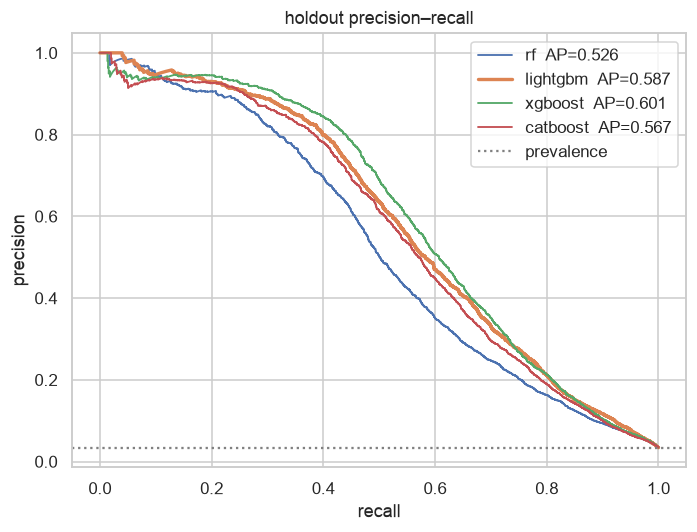
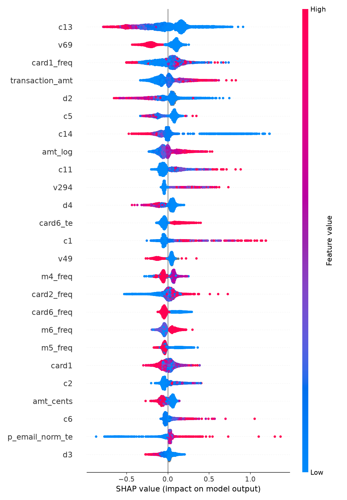

# fraudlake

**A production-shaped fraud-detection pipeline on the IEEE-CIS dataset: PySpark ingestion → Postgres SQL feature marts → gradient-boosted trees, validated the way production would judge them.**

```
kaggle csv ──► spark ingest ──► parquet (bronze / silver)
                                        │
                                        ▼
                         postgres feature marts (versioned SQL)
                                        │
                                        ▼
            time-aware CV · Optuna · LightGBM / XGBoost / CatBoost / RF
                                        │
                     MLflow · SHAP · bootstrap CIs · model card · registry
```

## What this shows

- **Data ingestion & pipelines.** 1.1M transactions × 435 columns go from raw CSV to typed, partitioned Parquet with a data-quality audit, then into Postgres by `COPY`, in under two minutes. Every stage is a CLI command that communicates through files and tables, so each can be re-run and tested alone.
- **PySpark.** Explicit schemas (no `inferSchema`), a reconstructed card-account fingerprint, and rolling velocity features via `Window.rangeBetween` on raw seconds. The same features are rebuilt in SQL and a test asserts the two implementations agree on every row.
- **SQL.** Seven versioned mart files using CTEs, `RANGE BETWEEN INTERVAL` window frames, `FILTER` clauses, `PERCENTILE_CONT`, and `LATERAL` joins, executed by a runner that records each file's SHA-256 in a migrations ledger. Every feature carries a one-line definition that the feature catalog is generated from.
- **Feature engineering & selection.** Card velocity, amount-vs-history z-scores, first-seen flags, device-sharing counts, stationary rarity shares. Selection by null rate, near-constant, correlation, **adversarial validation** (drops calendar proxies), and permutation importance, with a reason recorded for every dropped column.
- **Tree-based models.** RandomForest baseline, LightGBM, XGBoost and CatBoost behind one interface; Optuna tunes each on time folds; final refit uses the folds' early-stopping iterations.
- **Evaluation & validation.** Time-cut holdout, expanding-window folds with a gap, out-of-fold target encoding, bootstrap confidence intervals, cost-optimal threshold, calibration, SHAP, fold-to-fold importance stability, and a measured **optimism gap** between random K-fold and time-based validation.

## Results

<!-- results:start -->
| model | CV PR-AUC (time folds) | holdout PR-AUC | holdout ROC-AUC | precision@1% | recall@1% FPR |
|---|---|---|---|---|---|
| **lightgbm** (selected) | 0.6127 ± 0.0192 | 0.5866 [0.5697, 0.6011] | 0.9240 | 0.900 | 0.498 |
| xgboost | 0.6064 ± 0.0213 | 0.6005 | 0.9219 | 0.919 | 0.522 |
| catboost | 0.5948 ± 0.0181 | 0.5672 | 0.9151 | 0.896 | 0.492 |
| rf | 0.5295 ± 0.0255 | 0.5257 | 0.9073 | 0.872 | 0.450 |

| validation scheme | PR-AUC |
|---|---|
| shuffled stratified K-fold (the wrong way) | 0.7871 ± 0.0051 |
| expanding time folds with 1-day gap | 0.6127 ± 0.0192 |
| untouched time holdout (last 20%) | 0.5866 |

**Optimism gap of a random split: +0.2005 PR-AUC.**

_Holdout = last 20% of time, 104,637 transactions, 3.40% fraud. Model selected by CV before the holdout was opened. Bootstrap 95% CI in brackets. Registry `v2`, git `46fba25`._
<!-- results:end -->


| | |
|---|---|
|  |  |

Detailed numbers, operating point and limitations: [`docs/model_card.md`](docs/model_card.md).
Why the random-split number is not real: [`docs/validation_strategy.md`](docs/validation_strategy.md).
Every engineered feature and its leakage guarantee: [`docs/feature_catalog.md`](docs/feature_catalog.md).

## Five-minute tour for reviewers

1. [`sql/110_fct_velocity.sql`](sql/110_fct_velocity.sql) — window frames that end one second before the current row, and a `LATERAL` for distinct-count-in-window. Compare with the Spark version in [`src/fraudlake/ingest/silver.py`](src/fraudlake/ingest/silver.py) and the parity test in [`tests/test_sql_marts.py`](tests/test_sql_marts.py).
2. [`src/fraudlake/modeling/splits.py`](src/fraudlake/modeling/splits.py) — the time holdout and gapped expanding folds, with the reasoning in the module docstring.
3. [`src/fraudlake/features/selection.py`](src/fraudlake/features/selection.py) — adversarial validation and the other four filters; every drop gets a reason.
4. [`src/fraudlake/features/encoders.py`](src/fraudlake/features/encoders.py) — out-of-fold target encoding, and [`tests/test_encoders.py`](tests/test_encoders.py) proving a row never sees its own label.
5. [`docs/model_card.md`](docs/model_card.md) — generated, not typed: holdout metrics with CIs, operating point, what the model uses, limitations.
6. [`notebooks/02_validation_design.ipynb`](notebooks/02_validation_design.ipynb) — card overlap under each split scheme and the optimism gap, on the real data.

## Quickstart

Requirements: Python 3.12, Java 17 (for Spark), Docker, [`uv`](https://docs.astral.sh/uv/). On macOS LightGBM also needs `brew install libomp`.

```bash
make setup          # uv venv + deps
make db-up          # postgres:16 in docker (port 5439)

# real data (needs ~/.kaggle/kaggle.json and accepted competition rules)
make all            # data → ingest → features → select → train → evaluate → report

# or demo mode, no Kaggle account: synthetic data with the same schema
uv run fraudlake synth --rows 50000
make ingest features select train evaluate report
```

Stage by stage:

| command | what it does | writes |
|---|---|---|
| `fraudlake data` | download the four competition CSVs | `data/raw/` |
| `fraudlake ingest` | Spark: bronze → silver → Postgres `raw.transactions` | `data/bronze/`, `data/silver/`, audit JSON |
| `fraudlake features` | run `sql/*.sql` in order, record checksums | `feat.*`, `mart.training` |
| `fraudlake select` | feature selection on the training window | `artifacts/features/selected.json` |
| `fraudlake train` | Optuna + time-fold CV for each model, MLflow logging | `artifacts/models/<key>/`, `mlflow.db` |
| `fraudlake evaluate` | holdout metrics, random-vs-time comparison, SHAP, registry | `artifacts/evaluation/`, `artifacts/model/vN/` |
| `fraudlake report` | model card, feature catalog, README results | `docs/` |

Wall-clock on a 12-core laptop (24 GB): download ~1 min, ingest 1m53s (Spark bronze + silver + Postgres COPY of 1.1M rows), marts 1m40s, selection 4m38s, training ~3.5 h (random forest 8 trials, then a 60-minute Optuna budget for each of LightGBM, XGBoost and CatBoost), evaluation 7m20s.

`make mlflow-ui` opens the experiment tracker; `make test` runs the suite on a synthetic fixture (Spark local, Postgres via testcontainers) without any download.

## Layout

```
sql/                 000_schema · 010_stg · 100_dim_card · 110_fct_velocity · 120_fct_amount_stats
                     130_fct_device_email · 200_mart_training
src/fraudlake/
  ingest/            schema.py · bronze.py · silver.py · load_pg.py · download.py · spark.py
  features/          sql_runner.py · selection.py · encoders.py
  modeling/          splits.py · pipeline.py · models.py · train.py · metrics.py · evaluate.py
                     explain.py · registry.py · data.py
  synth.py           synthetic IEEE-CIS look-alike generator (tests + demo mode)
  report.py          generated docs
tests/               schema, bronze, silver, Spark↔SQL parity, leakage invariants,
                     splits, encoders, selection, end-to-end modelling
notebooks/           01_eda · 02_validation_design · 03_results
docs/                model_card · validation_strategy · feature_catalog
```

## Design decisions

**Why layers instead of one script.** Bronze is a faithful typed copy, silver is joined and enriched, marts are model-ready. Each layer has a contract and a test; a bug in a feature never requires re-reading 1.3 GB of CSV.

**Why the card fingerprint.** The dataset has no customer id. `D1` is "days since the card was first seen", so `txn_day − D1` is constant for one card account; `card1 ‖ addr1 ‖ (txn_day − D1)` recovers an account key that makes velocity and "first time this card did X" features possible.

**Why velocity is implemented twice.** Spark computes it at ingest time, SQL computes it in the warehouse. The parity test (`tests/test_sql_marts.py`) guarantees a feature-store style contract: the feature the model trained on is the feature the warehouse serves.

**Why time-based validation.** Random K-fold on this data leaks card identity across the split and never asks the model to extrapolate forward in time. The measured optimism gap is reported in the results table; the reasoning is in `docs/validation_strategy.md`.

**Why adversarial validation changed the SQL.** The first version of the rarity features counted prior occurrences of an email domain or device. A train-vs-holdout classifier reached AUC 0.99 on them because a cumulative count is a clock. They were redefined as shares of prior traffic, which are stationary. That decision trail is recorded in the SQL header.

**Why PR-AUC.** At 3.5% positives, ROC-AUC barely moves between a good and a great model. Average precision measures the queue a review team actually works.

**Why Postgres and not just DuckDB.** To show the same SQL running on the engine a feature pipeline would run on in production, with a real migrations ledger and indexes that the lateral joins depend on.

## Next steps

Structured Streaming replay of the transaction feed; a feature store service so the Spark and SQL definitions share one registry; drift monitoring on the adversarial-validation AUC; a scoring API around the registry artifact.

## Data

[IEEE-CIS Fraud Detection](https://www.kaggle.com/competitions/ieee-fraud-detection) (Vesta Corporation, via Kaggle). The data is not redistributed here; `fraudlake data` downloads it with your own credentials after you accept the competition rules.
