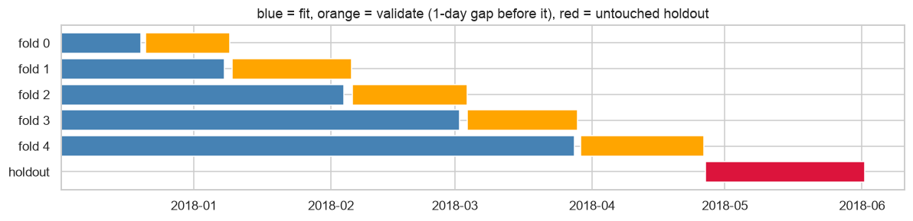
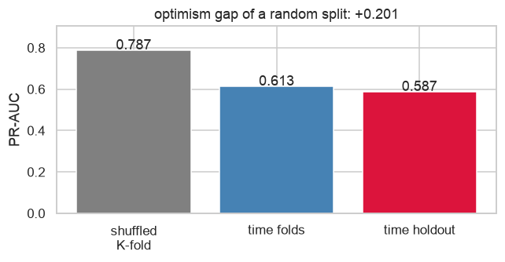
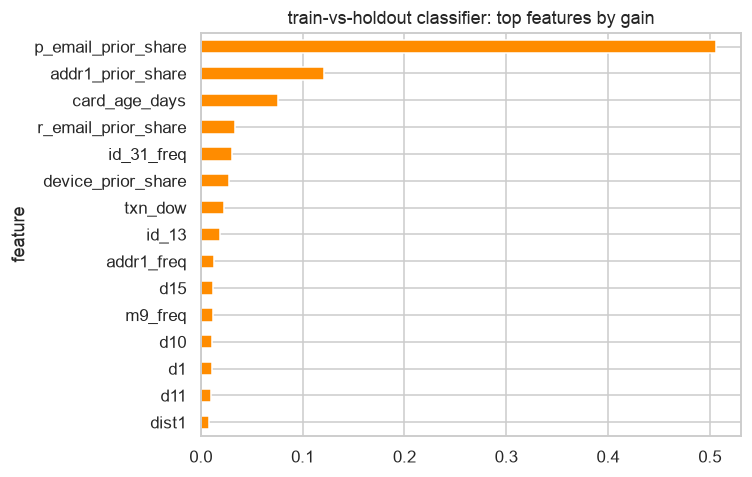

# Validation strategy

This document explains why the model is validated the way it is, and quantifies
what a naive setup would have gotten wrong. Numbers are filled in from
`data/artifacts/evaluation/metrics.json` by `fraudlake report`.

## The problem with random K-fold on this data

IEEE-CIS is six months of transactions, time-ordered, with a public test set
that is *later in time* than the training set. Two things break a shuffled
split:

1. **Entity leakage.** A card that transacts 40 times over the period lands in
   both train and validation. Tree models are excellent at memorising a card
   fingerprint (`card1`, `addr1`, the `D`-column anchors) and reading its label
   back. The validation score measures memory, not generalisation.
2. **Drift.** Fraud rate, merchant mix, and the anonymised `V`/`D` columns all
   move over the period. A model scored on interleaved data never has to
   extrapolate forward; a model in production always does.

The consequence is a validation score that is systematically too high, and,
worse, model choices (feature sets, hyper-parameters, early-stopping rounds)
tuned toward memorisation rather than the signal that survives a month of
drift.

## What this project does instead

```
|<---------------- training window (first 80% of time) --------------->|<-- holdout 20% -->|
| fold 0 train | gap | val 0 |
| fold 1 train ............. | gap | val 1 |
| fold 2 train ........................... | gap | val 2 |
| ...                                                                  |
```



- **Holdout = last 20% of time**, cut by timestamp not row count, opened once
  by `fraudlake evaluate` after the model family and hyper-parameters are
  fixed. Model *selection* uses CV; the holdout only quotes the final numbers
  and picks an operating threshold.
- **Expanding-window time folds** inside the training window
  (`sklearn.model_selection.TimeSeriesSplit`), with a **one-day gap** trimmed
  from the end of each fold's training range so windowed features that straddle
  the boundary cannot carry validation-period activity backwards.
- **Fold-safe encoders.** Frequency and target encodings are fit on each fold's
  training rows only. The target encoder produces out-of-fold values for the
  rows it is fit on, so no row's own label reaches its features (tested in
  `tests/test_encoders.py`).
- **Adversarial validation** during feature selection: a classifier is trained
  to distinguish training-window rows from holdout-window rows. If it succeeds
  (AUC above 0.75), the features it relies on are calendar proxies and are
  dropped. This is what caught the population-level "prior count" features and
  led to redefining them as shares (see `sql/130_fct_device_email.sql`).
- **Bootstrap confidence intervals** (1,000 resamples) on the holdout PR-AUC
  and ROC-AUC, so a difference between models is only claimed if the intervals
  say so.
- **Importance stability**: mean pairwise Spearman correlation of gain
  importance across folds. A model whose important features change every fold
  is fitting noise.

## The measured optimism gap

`fraudlake evaluate` retrains the selected configuration with shuffled
stratified 5-fold on the same training window and reports both numbers side by
side:

<!-- validation:start -->
| validation scheme | PR-AUC |
|---|---|
| shuffled stratified K-fold (the wrong way) | 0.7871 ± 0.0051 |
| expanding time folds with 1-day gap | 0.6127 ± 0.0192 |
| untouched time holdout (last 20%) | 0.5866 |

**Optimism gap of a random split: +0.2005 PR-AUC.**
<!-- validation:end -->





The gap is the amount by which a random split would have overstated the model's
performance. It is the single number I would put in front of a stakeholder who
asks why the offline score and the production score disagree.

## Metric choice

- **PR-AUC (average precision)** is the headline: with ~3.5% positives, ROC-AUC
  is dominated by easy negatives and moves little between a good and a great
  model. PR-AUC is the precision/recall trade-off the review team actually
  lives with.
- **ROC-AUC** is reported because it is the competition metric and allows
  comparison with the public leaderboard (bearing in mind those numbers are on
  Kaggle's own later-in-time test set, not this holdout).
- **precision@1%** and **recall at 1% false-positive rate** are the two
  operating points a fraud team asks about first.
- **Cost-optimal threshold**: expected cost = missed fraud × cost_fn + reviews ×
  cost_fp, minimised over the ranked holdout. The ratio (default 100:5) is a
  configuration parameter, not an assumption baked into the model.
- **Brier score and a calibration table** because a score that will be
  thresholded should also be roughly a probability.
